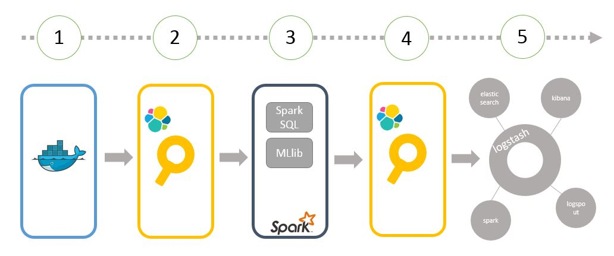

# Recommender

## 项目简介

[docker registry][1]支持把push, pull的events发送给webhook，这个被称作[registry notification][2], event数据包含用户及操作相关的信息，比如说event发生的时间，用户，action(pull/push)，所操作的docker repository的路径，manifest等等。这些信息给用户行为分析提供了丰富的素材。此项目的目的就是分析历史数据，对用户即将pull的docker image进行预测，从而给用户推荐他可能会感兴趣的image。

## Elasticsearch与Spark的整合

[spark][1]提供快速和大型数据处理的引擎，elasticsearch是性能优功能全的搜索引擎。以下是本项目涉及到的spark的一些功能，实现了读取数据，分析数据，储存结果的流程。
* [MLlib](https://spark.apache.org/mllib/), a scalable machine learning library,
* [Elasticsearch for Apache Hadoop](https://www.elastic.co/guide/en/elasticsearch/hadoop/master/reference.html), an open-source, stand-alone, self-contained, small library that allows Hadoop jobs to interact with Elasticsearch,
* [Spark Streaming](https://spark.apache.org/streaming/), a library to build scalable fault-tolerant streaming applications.

### Architecture:



图片显示了spark与elasticsearch整合的流程：

 (1)->(2). registry 发出实时的JSON形式的event数据，数据保存在NoSQL DB里面，同时发送给es。
 
 (2)->(3). spark job，通过org.elasticsearch.spark以及相应的search query，获取数据，使用Spark MLlib’s ALS推荐算法进行计算。
 
 (4)->(5). 给出每个user推荐的docker repository,并且将结果保存到es，供展示模块调用读取。步骤（5）中，当一个用户pull了一个logstash的image,我们的推荐系统可能就会推荐elasticsearch, kibana,logstash, logspout, spark等image，因为用户pull过elasticsearch的image，也会pull其他相关的一些image,这些image常常被组合起来使用,所以推荐系统会给出这些推荐建议。
 
### Machine Learning: The Alternating Least Squares Recommender Algorithm

* 建立ALS模型

```
//10, 5, 0.01, 1.0 is hyperparameter values
val model = ALS.trainImplicit(trainData, 10, 5, 0.01, 1.0)
``` 

* 评估评价质量：选取一部分作为train data，另外一部分用来计算AUC值，即这个推荐是好的推荐大于差的推荐的概率。

```
import org.apache.spark.rdd._

def areaUnderCurve(
    positiveData: RDD[Rating],
    bAllItemIDs: Broadcast[Array[Int]],
    predictFunction: (RDD[(Int,Int)] => RDD[Rating])) = {
  ...
}

val allData = buildRatings(rawUserArtistData, bArtistAlias) 1
val Array(trainData, cvData) = allData.randomSplit(Array(0.9, 0.1))
trainData.cache()
cvData.cache()

val allItemIDs = allData.map(_.product).distinct().collect() 2
val bAllItemIDs = sc.broadcast(allItemIDs)

val model = ALS.trainImplicit(trainData, 10, 5, 0.01, 1.0)
val auc = areaUnderCurve(cvData, bAllItemIDs, model.predict)
```


### Real-Time Stream Processing and Elasticsearch (TO DO)

Spark Streaming, which is capable to process about 400,000 records per node per second for simple aggregations on small records, significantly outperforms other popular streaming systems. This is mainly because Spark Streaming groups messages in small batches into a sequence of Spark RDDs (Resilient Distributed DataSets) using a sliding window. These RDDs can then be manipulated using normal Spark operations.


## How to run

### Environment Deployment

* Spark on Mesos
* Elastic on Mesos, including events data

### Run 
```
mvn package
```

* run from local
```
spark-submit --class com.cloudera.datascience.recommender.RunRecommender --master local --driver-memory 6g <jarfile>.jar <data folder>
```

* run from spark on marathon
```

dcos spark run --verbose --submit-args='--driver-memory 6g --class <jarfile>.jar <elasticsearch node:port>'
```

## Reference
[1]: Docker Distribution https://github.com/docker/distribution

[2]: Distribution Notification https://docs.docker.com/registry/notifications/

[3]: Spark http://spark.apache.org/

[4]: Elasticsearch-Hadoop https://www.elastic.co/guide/en/elasticsearch/hadoop/master/reference.html#reference
